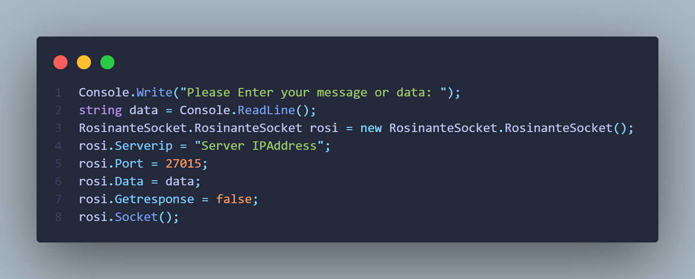

## CSharp-Socket-library
<a href="#CSharp-Socket-library">CSharp-Socket-library</a>
This Library help you to connect the socket server and send data to your server





## Built With
* [C#](https://docs.microsoft.com/en-us/dotnet/csharp/)
* [.NET Framework](https://dotnet.microsoft.com/en-us/download/dotnet-framework)


### Parameter
* Serverip
  ```sh
  set your IP address frist
  ```
* Port : DataType(string)
  ```sh
  set your Server port
  ```
* Data : DataType(int)
  ```sh
  your data that will send to the server
  ```
* Getresponse : DataType(bool)
  ```sh
  if you want to get response:DataType(string) of the server set true if not set false
  ```
* Port
  ```sh
  set your Server port
  ```
  
  
### Function
* Socket()
  ```sh
  this function will start send data to server
  ```
  
  
## Contact me

Email: Chawakorn.n@kkumail.com
Discord: ♥ E = 𝓡𝓸𝓼𝓲𝓷𝓪𝓷𝓽𝓮² ♥:7038
Line id: [https://line.me/ti/p/8REPWwkOuM](https://line.me/ti/p/8REPWwkOuM)
